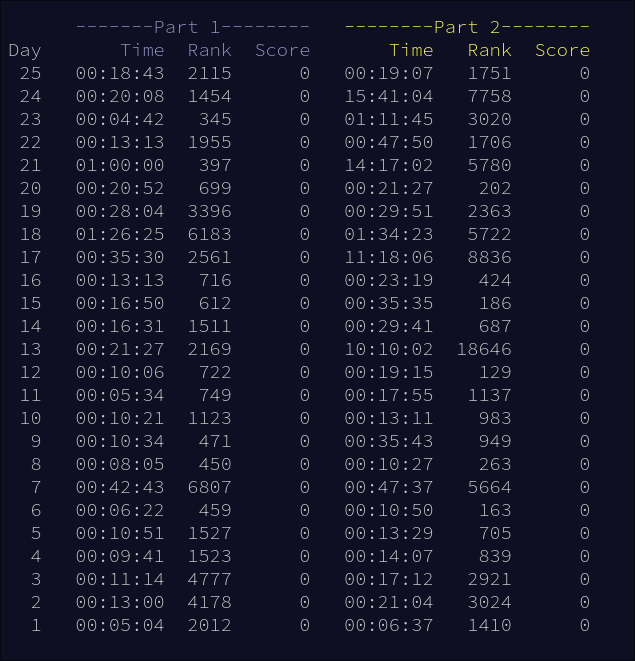

# Advent of Code 2024 Solutions

My personal solutions to all 25 (50 parts) [Advent of Code 2024 problems](https://adventofcode.com/2024).

## Personal Times

I was definitely doing better near the middle of the contest.
Some external factors got in my way near the end, and I didn't have much
practice at the beginning.

The problem that took me the longest was Day 24 Part 2 [(ripple-carry adder)](https://en.wikipedia.org/wiki/Adder_(electronics)),
mainly because I focused on solving the problem using my knowledge of [Abstract
Syntax Trees](https://en.wikipedia.org/wiki/Abstract_syntax_tree) (ASTs), when there were simpler solutions involving more human
intervention.

Day 21 Part 2 also took me quite some time, and I would say it was the most
difficult problem of the contest. I was sick that day, so I woke up late the
next morning and got to work, quickling realizing a key observation that led
to my solution.

My highest global rank was 129 on Day 12 Part 2. I remember thinking this part
was going to be quite difficult to implement, but I found a simple way to think
about it. I actually could have done much better than rank 129, because there
was an even simpler solution that I realized but thought would not work.

## Takeaways

### General Problem-solving Skills

* **Analyze Problem Inputs**: In Advent of Code, there are lots of problems
where it seems impossible at first, but there is a hidden constraint in the input.
For example Day 23 Part 2 is literally the [Clique Problem](https://en.wikipedia.org/wiki/Clique_problem),
which is known to be NP-Complete. It was possible to solve efficiently because
each node only had 13 edges. Day 17 was also easy to solve by manually analyzing
the input, and quite difficult (usually requiring evolutionary or bounded search approaches)
otherwise.

* **Adopt a BFS Approach**: I got stuck quite often on complicated approaches,
including on Day 24 Part 2 as mentioned above. The main reason for this was
[sunk-cost fallacy](https://en.wikipedia.org/wiki/Sunk_cost): I spent so much
time on one approach that I didn't want to switch to another. I found a solution
to this in summer 2024: solve problems with BFS, rather than DFS. When I first
see a problem, I should write down initial observations, and note any possible
solutions I come up with. If I think there could be a greedy algorithm, write it down.
Maybe there is a recurrence, so I should write down "maybe DP". Then, I can think
about one approach and if it is plausible, then switch to another if I am stuck.

* **Write Down Observations**: I get lazy sometimes and avoid writing down
observations about these problems. However, this sometimes costs me several minutes
of thinking and rethinking, just to land back at the same conclusion I had before.

* **Use Heuristics**: Day 14 Part 2 is a great example: there
are so many different approaches to find the christmas tree, but the simplest
have absolutely nothing to do with trees whatsoever. I just checked the number
of 3x3 areas filled in and guessed a random threshold. I immediately found the
solution. On Day 24 Part 2, many contestants found a small set of heuristics
allowing them to "suss out" certain operations, then manually intervening for
the swaps.

* **Stop Assuming Problem Statements**: Day 18 Part 1 is a great example of where
I accidentally made the problem significantly harder than necessary by assuming
what the problem statement said before I finished reading it. I thought we were
supposed to drop each byte one at a time while taking steps, so I used a 
complex BFS approach for that. We were actually supposed to just use the final
step, after all the bytes fell...

### Problem-Specific Skills

* **Input in C++**: I learned how to support variable-length inputs in C++, with
`while (cin >> ...)`, `while(getline(...))`, and how to get input in a specific
format using (ugly) `cin.ignore(...)` and (mostly better) `scanf("...", ...)`.

* **Base-3 Bitmask Search**: While the time complexity is still *technically* O(4^n),
if you iterate over two separate bitmasks in a nested loop and continue early
if they overlap somewhere, you can effectively iterate over 3^n possible masks.
(See my solution to Day 7)

* **`std::complex` is the GOAT**: It makes it super easy to add and multiply
vectors and positions, especially for math-heavy problems. I spent too much time 
"reimplementing the wheel" instead of just using this class.

* **Region Search**: For Day 17 Part 2, I (probably
because of sunk-cost fallacy) chose to create a search algorithm that would (probably) work
on any input, rather than analyzing my own input. I probably chose this approach
because I am used to other competitive programming websites where this is the
only option. I was searching manually in the terminal for a while and decided to
implement it in C++ instead. It checks a few values, then decides which regions
to recurse into. By carefully selecting how many values it checks, the algorithm
worked efficiently for my input.

* **Multiple Shortest Paths**: There were a couple problems where the solution
required finding spots in *any* of the shortest paths. I consistently used a
BFS approach for this, only allowing movement from each position if it reduces
the distance enough such that it would be on the shortest path. (See Day 20 Part 2)

* [**Bron-Kerbosch Algorithm**](https://en.wikipedia.org/wiki/Bron%E2%80%93Kerbosch_algorithm):
I learned about this after solving Day 23, and using it resulted in about 50 times
faster execution than my previous bitmask solution. I also learned form this problem
that every node in a clique must by in the intersection of all their adjacency lists
(assuming they are considered adjacent to themselves), which was the heart of my
bitmask solution.

* **Ripple-Carry Adder**: For Day 24 Part 2, I spent a lot of time (probably 7 hours...)
looking at the abstract syntax tree for the adder expression. Now I know the
general pattern of how they are written, and how they work.

## Conclusion

This was my first year completing all the problems for Advent of Code and I
learned a lot during the process. I made this README just so I can review
and prepare to do better next year!

